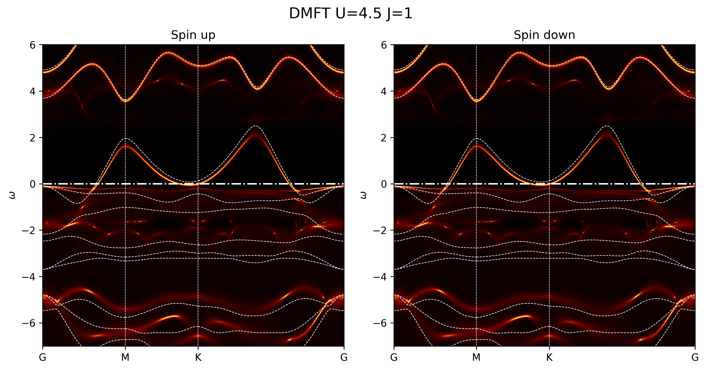

# DMFT+QSGW treatment of surface spins

Ongoing work on treating surface spins in LCO using Dynamical Mean Field Theory (DMFT) combined with Quasi-particle Self consistent GW (QSGW) and possibly QSGW+BSE for excitonic effects

  

